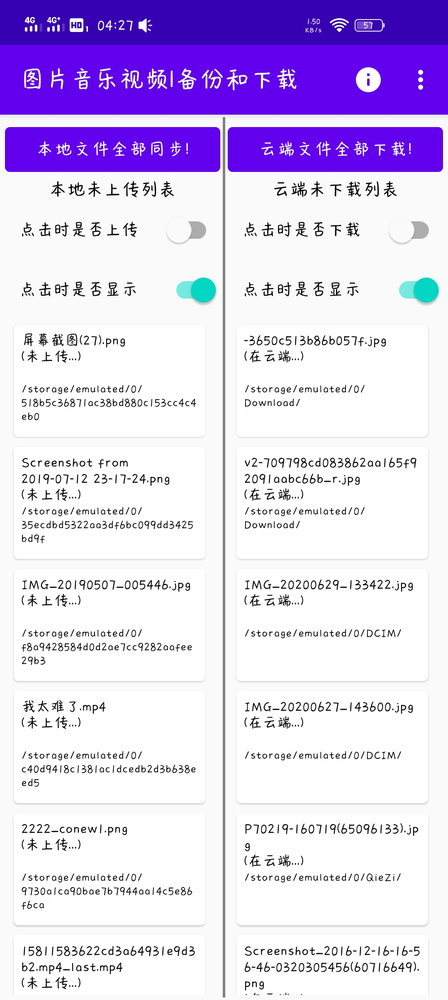
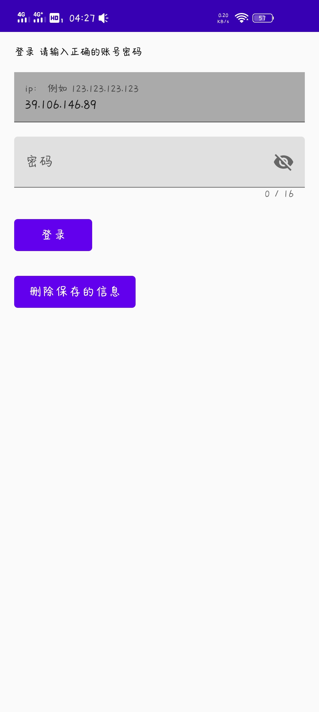

# backuponline
  This Android App allow you to backup your media files(Audio, Video, Image) to your server
  这是一个能让你将手机上的音频视频图片文件备份到Centos 服务器上的安卓应用

  put File "http.js" and "init.sh" in same folder on your Centos server,
  then run "sh init.sh"
  run "node http.js" or "supervisor http.js"
  把 "http.js" 和 "init.sh" 两个文件放到服务器上同一个文件夹
  然后执行 "sh init.sh"
  执行 "node http.js" 或 "supervisor http.js"

  input ip and password in the App's Setting page, ip is your server's ip, password is "hello12345"
  edit the File "http.js" to change your password 
  在应用的设置界面输入ip和密码，ip是服务器ip，密码为"hello12345"
  想要设置密码的话，修改"http.js"

  two screenshot of the app：
  下面是几张截图

  

  

